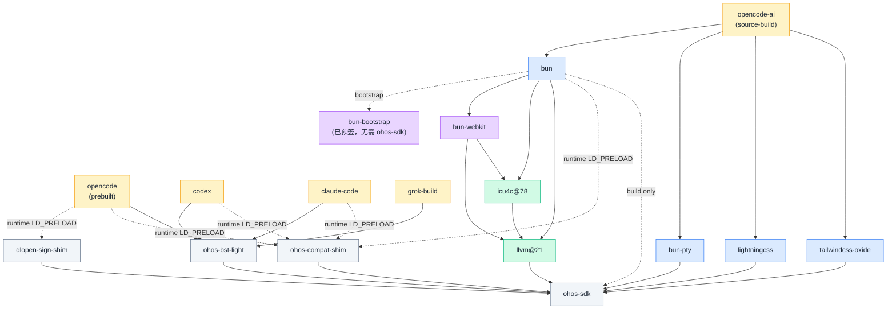

# social4hyq/homebrew-core

HarmonyOS (OHOS aarch64) 上从源码构建的 Homebrew tap，孵化那些还没法直接迁移到 [Harmonybrew/homebrew-core](https://atomgit.com/Harmonybrew/homebrew-core) 的 formula，等稳定后回流到官方 core。

> Harmonybrew/homebrew-core 是 Harmonybrew 的官方 core tap，绝大多数 formula 由上游 [Homebrew/homebrew-core](https://github.com/Homebrew/homebrew-core) 直接迁移；本仓库专门收尾那些需要在鸿蒙上从零打通自举链路的 formula。

> ⚠️ **早期阶段** — formula 已通过开发机 smoke 测试，未在多机型 / 多 HarmonyOS 版本上验证，不保证生产可用。

## 为什么暂时独立维护

最终目标是把这里稳定下来的 formula 合入官方 core。当前没合入，是因为三件事还没到位：

1. **Bun 上游正在改成 Rust 重写** —— 官方 OHOS aarch64 二进制还没出，Bun 源码持续大改。本仓库的 `bun` / `bun-bootstrap` / `bun-webkit` 一组都是过渡形态，跟着上游做 patch rebase。
2. **HarmonyOS 系统调用面和 Linux 还没对齐** —— Bun / opencode / codex 用到的一批 syscall 在鸿蒙内核尚未开放或未实现，通过 `ohos-compat-shim`（LD_PRELOAD 垫片，见下）在运行时兜底，可能影响功能完整性和性能（详见下表）。
3. **验证覆盖有限** —— 只在开发机上做过构建 / 安装 / smoke，没在多机型多版本上跑过。

## 已知限制

### 系统调用降级

2026-07-15 起，这些降级逻辑从 bun 源码内的 patch 整体搬到了独立的 `ohos-compat-shim`（LD_PRELOAD 垫片，`bun` / `opencode` / `codex` / `claude-code` 共用），bun 自身的 OHOS patch 集因此变薄。使用者一般不用关心，但极端场景下能感知到：

| 类别 | 鸿蒙缺什么 | 降级方式 | 用户能感知到的影响 |
|---|---|---|---|
| 部分 syscall | `close_range` / `openat2` / `epoll_pwait2` / `memfd` / `fchmodat2` / `pidfd` 返 `ENOSYS` | `ohos-compat-shim` 拦截并退到老 syscall（`close` 循环 / `openat` + `O_PATH` / `epoll_pwait` 等） | 冷启动略慢，高并发 IO 吞吐低于 Linux 基线 |
| 文件系统 | `linkat` 跨 hmdfs 分区返 `EPERM`；`getcwd` 在 hmdfs 上偶发失败；`/tmp` 只读 | `ohos-compat-shim` 提供 `linkat` 兜底（默认关闭，逐进程 opt-in）、`getcwd` 兜底；临时文件走 `$TMPDIR` | 跨分区硬链接退化成复制；`$TMPDIR` 必须指向可写分区 |
| 进程模型 | `vfork` 在 OHOS 不可靠 | `vfork → fork` | spawn 比 Linux 略重，功能无差异 |
| 平台名 | npm 生态没有 OHOS 概念 | `process.platform === "openharmony"`，`bun install --os=openharmony` 可用 | 三方包若 hard-code `linux` 需手动映射 |

### 其他限制

- **签名有四套并行路径，按产物来源区分**：
  - `bun` 内置 `ohos_sign` Rust crate（in-process，零 fork）—— `bun install` 装的 `.node`/`.so`、`bun build --compile` 产物、dlopen 兜底
  - `llvm@21` 的 `cc`/`c++` shim（LLD `--code-sign`，链接期签名）—— cargo build-script 产物、`icu4c@78`/`bun-webkit`/`bun-pty`/`lightningcss`/`tailwindcss-oxide` 等 source-build formula 的最终产物
  - `ohos-bst-light` 的 `self-sign`（保留 ELF section 布局，不像 `binary-sign-tool` 那样可能破坏结构）—— `codex`/`claude-code`/`grok-build`/`opencode`（prebuilt）这类从 npm/官方渠道直接 fetch 的二进制，以及 vendor 的 musl 运行时库（libstdc++/libgcc）
  - `dlopen-sign-shim`（LD_PRELOAD 拦截 `dlopen`/`dlmopen`）—— 运行时才解包落盘、无法在构建期预签的原生模块（`opencode` 的 `@opentui/core` 等）
- `claude-code` 遵循 Anthropic License，不在 bottle 里重新分发官方二进制：安装的是 runtime-fetch 包装脚本，首次运行时从 npmmirror（或 registry.npmjs.org 兜底）下载、校验 sha256、用 `ohos-bst-light` 自签并缓存
- `codex` / `opencode`（prebuilt）动态链接的 GCC 运行时（`libstdc++.so.6`/`libgcc_s.so.1`）OHOS 不自带，靠 Alpine musl 静态资源 + 就地 RUNPATH 注入解决（不能用 `patchelf`，会破坏 Bun 编译产物的 module graph）
- `grok-build` 是完全静态 ELF（无 INTERP/DYNAMIC segment），不需要 `ohos-compat-shim`/RUNPATH，只做一次 self-sign
- WebKit Inspector 走 socket 后端而非 glib 后端（OHOS 没有 GLib），远程调试连接方式和上游略有差异
- `icu4c@78` 用本仓库的 `llvm@21` 重编，让 ICU 的 libc++ 符号和 `bun` / `bun-webkit` 用同一个 mangling（`__h` namespace），避免链接器找不到符号
- 自签算法参考 [hqzing/ohos-bst-light](https://github.com/hqzing/ohos-bst-light)（fs-verity descriptor + SHA-256 merkle tree + `.codesign` ELF64 section 注入）
- `close-range-shim` 已于 2026-07-15 下线，功能并入更通用的 `ohos-compat-shim`
- bottle 只覆盖 `arm64_ohos`，不提供 macOS / x86_64 等其他平台产物

## 核心能力确认

以下能力已在 HarmonyOS aarch64 上验证通过（bun 1.4.0 r29）：

| 能力 | 状态 | 说明 |
|------|------|------|
| **JIT** (DFG + FTL) | JIT 三层全开 | `ENABLE_JIT=1`, `ENABLE_DFG_JIT=1`, `ENABLE_FTL_JIT=1`；`fib(25)×20` 14ms（解释器需 >800ms） |
| **Wasm JIT** (BBQ + OMG) | 已启用 | `ENABLE_WEBASSEMBLY_BBQJIT=1`, `ENABLE_WEBASSEMBLY_OMGJIT=1` |
| **NAPI** (node-gyp) | 100% 通过 | bun 自动配置 `CC=cc CXX=c++ LDFLAGS=-Wl,--code-sign`；需 `brew install llvm@21` 提供签名工具链 |
| **Workspace 签名** | 已修复 | `bun install` 对 hoisted + isolated linker 的 `.node`/`.so` 均自动签名 |

> JIT 验证命令：`bun -e "function fib(n){return n<=1?n:fib(n-1)+fib(n-2)};for(let i=0;i<5;i++)fib(25);const s=Date.now();for(let i=0;i<20;i++)fib(25);console.log(Date.now()-s+'ms',Date.now()-s<800?'JIT✓':'interpreter')"`

## Formulae

| Formula | 版本 | 说明 |
|---|---|---|
| `opencode` | 1.18.3（2026-07-17） | OpenCode AI 编码代理 CLI，**预编译 musl 二进制**（从 npmmirror 拉取 `opencode-linux-arm64-musl`）；注入 RUNPATH 补 Alpine libstdc++/libgcc，LD_PRELOAD `dlopen-sign-shim` + `ohos-compat-shim` |
| `opencode-ai` | 1.17.15 @ `v1.17.15`（2026-07-09） | opencode 的**源码构建**变体（`bun build --compile` 单文件二进制），原 `opencode` 改名而来；依赖本 tap 的 `bun`/`bun-pty`/`lightningcss`/`tailwindcss-oxide` |
| `codex` | 0.144.5（2026-07-17） | OpenAI Codex CLI；从 npmmirror 拉取 `linux-arm64` musl 静态二进制 + `ohos-bst-light` 自签；内置 ripgrep 替换为本 tap 的 musl 版 |
| `claude-code` | 2.1.212（2026-07-17） | Anthropic Claude Code CLI；**runtime-fetch stub**（Anthropic License 不允许重分发官方二进制），首次运行拉取 + 自签 + 缓存 |
| `grok-build` | 0.2.102（2026-07-17） | xAI Grok Build CLI；完全静态 ELF，仅 `ohos-bst-light` self-sign，无需 shim/RUNPATH |
| `bun` | 1.4.0 r30 @ `87e50375`（ohos-aarch64，2026-07-17） | Bun JavaScript runtime；已并入 upstream main `6618e7f7e`；运行时签名由内置 `ohos_sign` crate 承担；`bin/bun` 包装脚本 LD_PRELOAD `ohos-compat-shim` |
| `bun-bootstrap` | 1.4.0-5467a689（2026-07-07） | 预编译 bun，用来启动 `bun bd` 自举本机 bun；已内置 ohos_sign，无需 ohos-sdk（`keg_only`） |
| `bun-webkit` | `4895f45dfb`（2026-07-17） | JavaScriptCore / WTF / bmalloc 静态库，bun 专用 WebKit fork（`keg_only`） |
| `bun-pty` | 0.4.10（2026-06-15） | `librust_pty.so`，portable-pty + nix 0.31 OHOS 支持（`keg_only`，供 `opencode-ai` 构建用） |
| `lightningcss` | 1.30.1（2025-05-14） | `liblightningcss_node.so` CSS 原生绑定（`keg_only`，供 `opencode-ai` 构建用） |
| `tailwindcss-oxide` | 4.1.11（2025-06-26） | `libtailwind_oxide.so` Tailwind v4 原生引擎绑定（`keg_only`，供 `opencode-ai` 构建用） |
| `llvm@21` | 21.1.8（2025-12-16），revision 2 | OHOS 补丁版 clang + lld + multiarch runtime libs；cc/c++ shim 内置 LLD `--code-sign` 链接签名（**裁剪版**，`keg_only`） |
| `icu4c@78` | 78.3（2026-03-17），revision 1 | Unicode 库，用本仓库 llvm@21 重编以对齐 libc++ ABI（`keg_only`） |
| `ohos-bst-light` | 1.0.0（2026-07-10） | 轻量二进制自签工具，保留 ELF 结构不被破坏；`codex`/`claude-code`/`grok-build`/`opencode` 等运行时/构建期 self-sign 都靠它 |
| `ohos-compat-shim` | 0.1.0（2026-07-15，新增） | LD_PRELOAD 兼容垫片：拦截 `close_range`/`fchmodat2`/`getpwuid_r`/`tmpfile`/`getcwd`/（可选）`linkat`；`bun`/`opencode`/`codex`/`claude-code` 共用，取代 `close-range-shim` |
| `dlopen-sign-shim` | 0.1.0（2026-07-14，新增，从 `opencode` 拆出） | LD_PRELOAD 垫片：`dlopen`/`dlmopen` 前自动 self-sign 未签名 ELF，兜底运行时才解包落盘的原生模块 |

> `close-range-shim` 已于 2026-07-15 移除（功能被 `ohos-compat-shim` 取代，不再是独立 formula）。

## Bottle 状态

所有 bottle 均面向 `arm64_ohos`：

| Formula | Bottle tag |
|---------|-----------|
| `llvm@21` | `llvm21-v21.1.8-pruned-r5`（2026-07-17，容器构建 + cmake readdir-errno 修复） |
| `icu4c@78` | `icu4c@78-v78.3-r2` |
| `bun-webkit` | `bun-webkit-v4895f45dfb-r1`（2026-07-17，容器构建） |
| `bun-pty` | `bun-pty-v0.4.10-r2` |
| `lightningcss` | `lightningcss-v1.30.1-r2` |
| `tailwindcss-oxide` | `tailwindcss-oxide-v4.1.11-r2` |
| `bun` | `bun-v1.4.0-r30`（2026-07-17，容器构建） |
| `opencode` | `opencode-v1.18.3`（prebuilt，非本仓库源码构建） |
| `opencode-ai` | `opencode-v1.17.15-r1` |
| `codex` | `codex-v0.144.5` |
| `claude-code` | `claude-code-v2.1.212`（stub bottle，仅含 wrapper，官方二进制 runtime-fetch） |
| `grok-build` | `grok-build-v0.2.102` |
| `ohos-bst-light` | `ohos-bst-light-v1.0.0` |
| `ohos-compat-shim` | `ohos-compat-shim-v0.1.0` |
| `dlopen-sign-shim` | `dlopen-sign-shim-v0.1.0` |

> `bun-bootstrap` 为预编译 binary pour，tag `bun-bootstrap-v1.4.0-5467a689`。

## 依赖图



## 安装

```bash
brew tap social4hyq/core https://atomgit.com/social4hyq/homebrew-core.git
brew trust social4hyq/core         # Homebrew 6.0+ 必须显式信任第三方 tap

# 只装 bun：
brew install bun

# 只装 opencode（预编译二进制，默认选项）：
brew install opencode

# 装源码构建的 opencode-ai（会拉 bun/bun-pty/lightningcss/tailwindcss-oxide 编译）：
brew install opencode-ai

# 只装 claude-code / codex / grok-build（均从官方渠道拉取二进制 + 自签，依赖均已有 bottle）：
brew install claude-code
brew install codex
brew install grok-build
```

装完跑一次 smoke：

```bash
bun --version && bun -e 'console.log(2**32, Math.PI)'
opencode --version
claude --version
codex --version
grok --version
```

## 上游 PR 进展

本仓库的长期目标是把适配推回上游，消除 formula 层 workaround。

| 包 | PR | 状态 |
|---|---|---|
| `lightningcss` | [parcel-bundler/lightningcss#1264](https://github.com/parcel-bundler/lightningcss/pull/1264) | 已提交，待合并 |
| `@tailwindcss/oxide` | [tailwindlabs/tailwindcss#20276](https://github.com/tailwindlabs/tailwindcss/pull/20276) | 已提交，评审意见已处理，待合并 |

PR 合并并发布后，`opencode-ai.rb` 中对应的 `index.js` 字符串替换 patch 可以删除，直接用上游原生包；默认安装的 `opencode`（预编译二进制）不受影响 —— 它本来就是纯 vendor 二进制，不做本地构建。

## 最近变更

```
dc39127a2 grok-build: new formula for xAI's Grok Build CLI
99afc0bfa bottle(llvm@21): rebuild bottle llvm21-v21.1.8-pruned-r5 (container build, cmake readdir-errno fix)
beeacf9af opencode: bump to 1.18.3
b884a2e28 codex: bump to 0.144.5
06d72d110 claude-code: bump to 2.1.212
660c4e8bc bottle(llvm@21): rebuild bottle llvm21-v21.1.8-pruned-r4 (revision 2)
03dd3743e bun: wire ohos-compat-shim via LD_PRELOAD wrapper
7c02f7682 close-range-shim: remove formula (superseded by ohos-compat-shim)
54e65daf7 opencode: 1.17.20 -> 1.18.1, switch source to npmmirror
ce31d3426 codex: 0.144.3 -> 0.144.4, switch source to npmmirror
5270c750d claude-code: 2.1.207 -> 2.1.210
23f72073f opencode: revision 5, swap close-range-shim for ohos-compat-shim
1fb52fece codex: revision 3, swap close-range-shim for ohos-compat-shim
359199c0e claude-code: stub bottle (runtime-fetch) + swap to ohos-compat-shim
f9d06b87b ohos-compat-shim: new formula, LD_PRELOAD compat shim (close_range/getpwuid_r/tmpfile/getcwd/fchmodat2)
5a0cee6fa opencode: revision 3, extract dlopen_sign_shim into own formula
724f10189 opencode: revision 1, fix Cellar-absolute RUNPATH/self-reference for portability
64af51870 opencode: new formula, prebuilt musl binary + RUNPATH injection (replaces source-build)
5dec7e69d codex: new formula, OpenAI Codex CLI prebuilt musl binary + self-sign
da1cbfe97 opencode-ai: rename from opencode, free up opencode name for prebuilt binary formula
```

## 反馈与贡献

- 遇到功能差异或崩溃，请附：HarmonyOS 版本、`bun --version`、复现命令、是否触及上面表格里的降级类别
- Bun / Rust 一旦发布官方 OHOS aarch64 版本，本仓库会优先切到上游产物，过渡 formula 简化或下线
