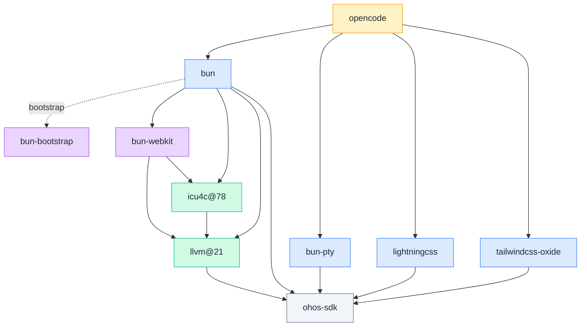

# social4hyq/homebrew-core

HarmonyOS (OHOS aarch64) 上从源码构建的 Homebrew tap，孵化那些还没法直接迁移到 [Harmonybrew/homebrew-core](https://atomgit.com/Harmonybrew/homebrew-core) 的 formula，等稳定后回流到官方 core。

> Harmonybrew/homebrew-core 是 Harmonybrew 的官方 core tap，绝大多数 formula 由上游 [Homebrew/homebrew-core](https://github.com/Homebrew/homebrew-core) 直接迁移；本仓库专门收尾那些需要在鸿蒙上从零打通自举链路的 formula。

> ⚠️ **早期阶段** — formula 已通过开发机 smoke 测试，未在多机型 / 多 HarmonyOS 版本上验证，不保证生产可用。

## 为什么暂时独立维护

最终目标是把这里稳定下来的 formula 合入官方 core。当前没合入，是因为三件事还没到位：

1. **Bun 上游正在改成 Rust 重写** —— 官方 OHOS aarch64 二进制还没出，Bun 源码持续大改。本仓库的 `bun` / `bun-bootstrap` / `bun-webkit` 一组都是过渡形态，跟着上游做 patch rebase。
2. **HarmonyOS 系统调用面和 Linux 还没对齐** —— Bun 用到的一批 syscall 在鸿蒙内核尚未开放或未实现，本仓库通过 fallback 绕过，可能影响功能完整性和性能（详见下表）。
3. **验证覆盖有限** —— 只在开发机上做过构建 / 安装 / smoke，没在多机型多版本上跑过。

## 已知限制

### 系统调用降级

下面这些差异在 Bun 主代码里通过 patch 处理掉了，使用者一般不用关心，但极端场景下能感知到：

| 类别 | 鸿蒙缺什么 | 降级方式 | 用户能感知到的影响 |
|---|---|---|---|
| 部分 syscall | `close_range` / `openat2` / `epoll_pwait2` / `memfd` / `fchmodat2` / `pidfd` 返 `ENOSYS` | 退到老 syscall（`close` 循环 / `openat` + `O_PATH` / `epoll_pwait` 等） | 冷启动略慢，高并发 IO 吞吐低于 Linux 基线 |
| 文件系统 | `linkat` 跨 hmdfs 分区返 `EPERM`；`getcwd` 在 hmdfs 上偶发失败；`/tmp` 只读 | `linkat` 多级 fallback；`getcwd` 兜底；临时文件走 `$TMPDIR` | 跨分区硬链接退化成复制；`$TMPDIR` 必须指向可写分区 |
| 进程模型 | `vfork` 在 OHOS 不可靠；部分 socket flag 缺失 | `vfork → fork`，spawn 走 `fork + exit_group` 路径 | spawn 比 Linux 略重，功能无差异 |
| 平台名 | npm 生态没有 OHOS 概念 | `process.platform === "openharmony"`，`bun install --os=openharmony` 可用 | 三方包若 hard-code `linux` 需手动映射 |

### 其他限制

- WebKit Inspector 走 socket 后端而非 glib 后端（OHOS 没有 GLib），远程调试连接方式和上游略有差异
- `icu4c@78` 用本仓库的 `llvm@21` 重编，让 ICU 的 libc++ 符号和 `bun` / `bun-webkit` 用同一个 mangling（`__h` namespace），避免链接器找不到符号
- 所有 ELF 必须经 `ohos-sdk` 的 `binary-sign-tool` 自签后才能执行，formula 内已经处理；二次打包请保留签名步骤
- bottle 只覆盖 `arm64_ohos`，不提供 macOS / x86_64 等其他平台产物

## Formulae

| Formula | 版本 | 说明 |
|---|---|---|
| `opencode` | 1.17.13 @ `10c894bd`（2026-07-03） | OpenCode AI 编码代理 CLI（单文件二进制 + 嵌入 Web UI） |
| `bun` | 1.4.0 @ `1498d7b77a`（main，2026-07-03） | Bun JavaScript runtime |
| `bun-bootstrap` | 1.4.0 @ `e0acad318`（main，2026-06-15） | 预编译 bun，用来启动 `bun bd` 自举本机 bun（`keg_only`） |
| `bun-webkit` | `c9ad5813fd`（2026-07-03） | JavaScriptCore / WTF / bmalloc 静态库，bun 专用 WebKit fork（`keg_only`） |
| `bun-pty` | 0.4.10（2026-06-15） | `librust_pty.so`，portable-pty + nix 0.31 OHOS 支持（`keg_only`） |
| `lightningcss` | 1.30.1（2025-05-14） | `liblightningcss_node.so` CSS 原生绑定（`keg_only`） |
| `tailwindcss-oxide` | 4.1.11（2025-06-26） | `libtailwind_oxide.so` Tailwind v4 原生引擎绑定（`keg_only`） |
| `llvm@21` | 21.1.8（2025-12-16） | OHOS 补丁版 clang + lld + multiarch runtime libs（**裁剪版**，仅工具链，71 MB，`keg_only`） |
| `icu4c@78` | 78.3（2026-03-17） | Unicode 库，用本仓库 llvm@21 重编以对齐 libc++ ABI（`keg_only`） |

## Bottle 状态

所有 bottle 均面向 `arm64_ohos`：

| Formula | Bottle tag | 大小 |
|---------|-----------|------|
| `llvm@21` | `llvm21-v21.1.8-pruned-r2` | 71 MB |
| `icu4c@78` | `icu4c@78-v78.3-r2` | 32 MB |
| `bun-webkit` | `bun-webkit-vc9ad5813fd-r1` | 23 MB |
| `bun-pty` | `bun-pty-v0.4.10-r2` | 270 KB |
| `lightningcss` | `lightningcss-v1.30.1-r2` | 3.4 MB |
| `tailwindcss-oxide` | `tailwindcss-oxide-v4.1.11-r2` | 1.3 MB |
| `bun` | `bun-v1.4.0_1` | 40 MB |
| `opencode` | `opencode-v1.17.13-r6` | 58 MB |

> `bun-bootstrap` 为预编译 binary pour（41 MB），tag `bun-bootstrap-v1.4.0-e0acad318`。

## 依赖图



## 安装

```bash
brew tap social4hyq/core https://atomgit.com/social4hyq/homebrew-core.git
brew trust social4hyq/core         # Homebrew 6.0+ 必须显式信任第三方 tap

# 只装 bun：
brew install bun

# 只装 opencode：
brew install opencode
```

装完跑一次 smoke：

```bash
bun --version && bun -e 'console.log(2**32, Math.PI)'
opencode --version
```

## 上游 PR 进展

本仓库的长期目标是把适配推回上游，消除 formula 层 workaround。

| 包 | PR | 状态 |
|---|---|---|
| `lightningcss` | [parcel-bundler/lightningcss#1264](https://github.com/parcel-bundler/lightningcss/pull/1264) | 已提交，待合并 |
| `@tailwindcss/oxide` | [tailwindlabs/tailwindcss#20276](https://github.com/tailwindlabs/tailwindcss/pull/20276) | 已提交，评审意见已处理，待合并 |

PR 合并并发布后，`opencode.rb` 中对应的 `index.js` 字符串替换 patch 可以删除，直接用上游原生包。

## 反馈与贡献

- 遇到功能差异或崩溃，请附：HarmonyOS 版本、`bun --version`、复现命令、是否触及上面表格里的降级类别
- Bun / Rust 一旦发布官方 OHOS aarch64 版本，本仓库会优先切到上游产物，过渡 formula 简化或下线
