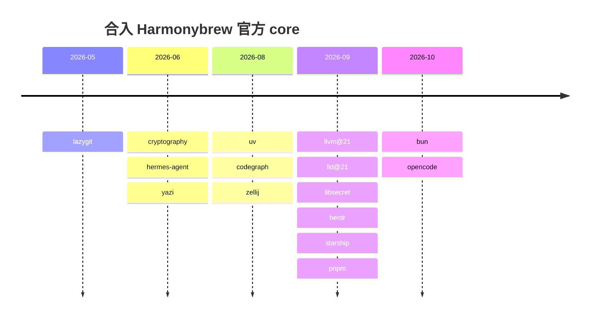

# Harmonybrew 第三方 tap · 鸿蒙 PC 工具链

致力于补齐鸿蒙 PC 工具链，`brew install` 即装即用。[Harmonybrew](https://harmonybrew.atomgit.com) 是 Homebrew 的鸿蒙移植。npm 包的鸿蒙适配在社区仓 [ohos-npm-ports](https://github.com/ohos-npm-ports/ohos-npm-ports)，npm 包装不上或跑不起来时先去那里找。

## 快速开始

```bash
brew tap social4hyq/core https://atomgit.com/social4hyq/homebrew-core.git
brew trust social4hyq/core   # Homebrew 6.0+ 必须显式信任第三方 tap

brew install social4hyq/core/opencode   # 本 tap：AI 编码代理（须全限定名；与 opencode-v1 互斥）
brew install claude-code                # 本 tap：Claude Code CLI
brew install vite-plus                  # 本 tap：前端工具链（`vp` 命令）
brew install qemu-aarch64               # 本 tap：用户态 QEMU（含 `-strace`）
brew install hishell-font starship      # 终端图标字体 + 提示符（starship 来自官方 core）
```

## 合入进度

formula 成熟后合入 [Harmonybrew 官方 core](https://atomgit.com/Harmonybrew/homebrew-core)，本 tap 随之下线自有版本。


```mermaid
timeline
    title 合入 Harmonybrew 官方 core
    2026-05 : lazygit
    2026-06 : cryptography : hermes-agent : yazi
    2026-08 : uv : codegraph : zellij
    2026-09 : llvm@21 : lld@21 : libsecret : herdr : starship : pnpm
    2026-10 : bun : opencode
```

| Formula | 作用 | 上游 ⭐ | 状态 | PR |
|---|---|---|---|---|
| `lazygit` | Git 终端界面，在终端里用键盘完成暂存、提交、分支、rebase 等操作 | 83k | ✅ 已合入 | [!8586](https://gitcode.com/Harmonybrew/homebrew-core/merge_requests/8586) |
| `cryptography` | Python 事实标准的加密库，SSH、TLS、证书、JWT 等大量 Python 库的底层依赖 | 7.8k | ✅ 已合入 | [!10480](https://gitcode.com/Harmonybrew/homebrew-core/merge_requests/10480) |
| `hermes-agent` | Nous Research 的自我进化 AI Agent，能从经验中沉淀出可复用的技能 | 251k | ✅ 已合入 | [!10485](https://gitcode.com/Harmonybrew/homebrew-core/merge_requests/10485) |
| `yazi` | Rust 编写、异步 I/O 的极速终端文件管理器，支持预览与插件 | 43k | ✅ 已合入 | [!10780](https://gitcode.com/Harmonybrew/homebrew-core/merge_requests/10780) |
| `uv` | Rust 编写的极速 Python 包安装器与解析器，可替代 pip、venv 等 | 90k | ✅ 已合入 | [!17130](https://gitcode.com/Harmonybrew/homebrew-core/merge_requests/17130) |
| `codegraph` | 面向 AI coding agent 的预索引代码知识图谱，全本地运行，让 agent 少读文件、省 token | 73k | ✅ 已合入 | [!17567](https://gitcode.com/Harmonybrew/homebrew-core/merge_requests/17567) |
| `zellij` | 可扩展的终端工作区，以终端复用器为基础，支持 WASM 插件 | 36k | ✅ 已合入 | [!17569](https://gitcode.com/Harmonybrew/homebrew-core/merge_requests/17569)（[!18645](https://gitcode.com/Harmonybrew/homebrew-core/merge_requests/18645)） |
| `llvm@21` | 现代编译器基础设施（clang 等），C/C++ 等原生工具链的基础 | 41k | ✅ 已合入 | [!18194](https://gitcode.com/Harmonybrew/homebrew-core/merge_requests/18194) |
| `lld@21` | LLVM 的链接器，链接速度快 | 同上 | ✅ 已合入 | [!18536](https://gitcode.com/Harmonybrew/homebrew-core/merge_requests/18536) |
| `libsecret` | GNOME 的密钥存储库，不少 CLI 工具靠它安全保存密码和令牌 | — | ✅ 已合入 | [!18633](https://gitcode.com/Harmonybrew/homebrew-core/merge_requests/18633) |
| `herdr` | 住在终端里的 Agent 复用器，一个界面管理多个 coding agent 会话 | 42k | ✅ 已合入 | [!18651](https://gitcode.com/Harmonybrew/homebrew-core/merge_requests/18651)（[!20617](https://gitcode.com/Harmonybrew/homebrew-core/merge_requests/20617)、[!20719](https://gitcode.com/Harmonybrew/homebrew-core/merge_requests/20719)） |
| `starship` | 跨 shell 的极简、高度可定制的终端提示符 | 60k | ✅ 已合入 | [!18673](https://gitcode.com/Harmonybrew/homebrew-core/merge_requests/18673)（[!18770](https://gitcode.com/Harmonybrew/homebrew-core/merge_requests/18770)） |
| `pnpm` | 快速、省磁盘的 Node 包管理器（v12 为 Rust 重写） | 37k | ✅ 已合入 | [!20806](https://gitcode.com/Harmonybrew/homebrew-core/merge_requests/20806) |
| `bun` | 集运行时、包管理、测试、打包于一体的极速 JavaScript 工具链 | 96k | ✅ 已合入 | [!21450](https://gitcode.com/Harmonybrew/homebrew-core/merge_requests/21450) |
| `opencode` | 开源的终端 AI 编程助手，自带 75+ 模型提供商接入（v2） | 211k | ✅ 已合入 | [!21455](https://gitcode.com/Harmonybrew/homebrew-core/merge_requests/21455) |
| `vite-plus` | VoidZero 的 Web 统一工具链，一个 `vp` 命令覆盖创建、开发、检查、格式化、测试、构建 | 5.9k | 计划合入 | — |
| `zcode` | AI 编程工作台，终端 agent（TUI）与 Web IDE 双形态 | 7.3k | 计划合入 | — |
| `ohos-compat-shim` | 兜底鸿蒙与标准 Linux 底层差异的 LD_PRELOAD 兼容层，随 `claude-code` 自动安装 | — | 待定 | — |
| `qemu-aarch64` | 用户态 QEMU，直接运行 Linux aarch64 程序，自带 `-strace` 系统调用跟踪 | 14k | 期待官方 core 提供 | — |
| `claude-code` / `claude-code.latest` | Anthropic 官方 Claude Code 终端版（stable / latest 两个频道） | 149k | 无计划（闭源，只能拉取官方二进制） | — |
| `opencode-v1` | opencode 的 v1 稳定版 | 211k | 无计划 | — |
| `sshport` | 把远程开发机的服务端口映射到本机同名端口 | — | 无计划（内部小工具） | — |
| `hishell-font` | 为鸿蒙 PC 终端（HiShell）安装并配置 Nerd Font | — | 无计划（内部小工具） | — |

上游 ⭐ 为 GitHub star 数（2026-10-02 取值），括号内为后续修复 PR。

## 迁移说明

上表「已合入」的 formula，以及 `codex`、`cc-switch`、`reasonix`、`deepseek-harness`、`nvm`、`ohos-bst-light`、`node-ohos`，现已由官方 core 提供。已装本 tap 旧版的，先 `brew uninstall social4hyq/core/<名>`，再 `brew install <名>`。特例：`cc-switch` 在官方 core 叫 `cc-switch-cli`，`node-ohos` 叫 `node`，`ohos-bst-light` 的命令名由 `self-sign` 变为 `selfsign`。其余下线项与改名见 [docs/offline-history.md](docs/offline-history.md)。

## 已知限制

鸿蒙 PC 终端强制代码签名：本 tap 的产物已签名，自行编译或下载的程序需自行签名，否则 `Permission denied`；系统调用等底层差异由 `ohos-compat-shim` 兜底。逐项说明见 [docs/known-limitations.md](docs/known-limitations.md)。

## 反馈与仓库

问题请到 [GitHub Issues](https://github.com/social4hyq/homebrew-core/issues) 反馈，附 HarmonyOS 版本、`<工具> --version`、复现命令。本仓库以 GitHub 为唯一源头；[atomgit 同名仓库](https://atomgit.com/social4hyq/homebrew-core) 是单向镜像，只为国内更快下载 bottle，请勿向其推送或开 PR。

## 致谢

感谢 **hqzing** 的《鸿蒙 PC 底层开发技术详解》系列和开源的自签工具 `ohos-bst-light`，为本 tap 提供了重要参考：

- 《鸿蒙 PC 底层开发技术详解（四）：代码签名机制对我们的影响》 — https://blog.csdn.net/hqzing/article/details/160746583
- 《鸿蒙 PC 底层开发技术详解（七）：二进制自签名算法的实现》 — https://blog.csdn.net/hqzing/article/details/162642397
- 《鸿蒙 PC 底层开发技术详解（八）：鸿蒙 PC 上的问题定位手段》 — https://blog.csdn.net/hqzing/article/details/163311519
- 《在鸿蒙 PC 上使用 Claude Code（最新的 Bun 版本）》 — https://blog.csdn.net/hqzing/article/details/162758675
