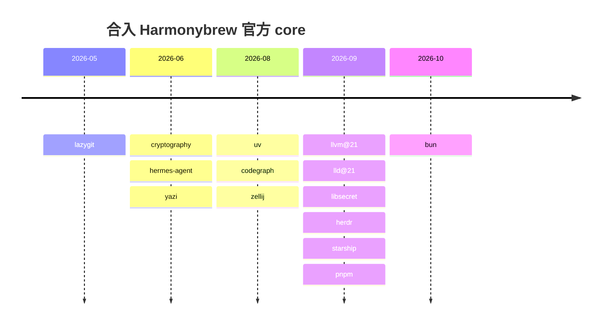

# Harmonybrew 第三方 tap · 鸿蒙 PC 工具链

致力于补齐鸿蒙 PC 工具链，覆盖 **Agent 工具**（opencode、Claude Code 等）、**前端构建**（vite-plus 等）和**效率工具**（终端字体、端口转发等），`brew install` 即装即用。[Harmonybrew](https://harmonybrew.atomgit.com) 是 Homebrew 的鸿蒙移植。

> 已向 [Harmonybrew 官方 core](https://atomgit.com/Harmonybrew/homebrew-core) 贡献并合入 **14 个 formula（18 个 PR）**，见「[贡献](#贡献)」。
>
> npm 包的鸿蒙适配在社区仓 [ohos-npm-ports/ohos-npm-ports](https://github.com/ohos-npm-ports/ohos-npm-ports) 持续进行，项目里的 npm 包装不上或跑不起来，先到那里找适配包。

## 快速开始

```bash
brew tap social4hyq/core https://atomgit.com/social4hyq/homebrew-core.git
brew trust social4hyq/core   # Homebrew 6.0+ 必须显式信任第三方 tap

brew install social4hyq/core/opencode   # 本 tap：AI 编码代理（v1：brew install opencode-v1）
brew install claude-code                # 本 tap：Claude Code CLI
brew install vite-plus                  # 本 tap：前端工具链（`vp` 命令）
brew install hishell-font               # 本 tap：终端图标字体
brew install qemu-aarch64               # 本 tap：用户态 QEMU（含 `-strace`）
brew install bun starship               # 官方 core：Bun 运行时、终端提示符（配合 hishell-font）
```

装完用 `opencode --version`、`claude --version`、`vp --version` 验证。shell 补全（bash / zsh / fish）随安装自动装入。

## 本 tap 的工具

### Agent 工具

- `social4hyq/core/opencode`（v2）/ `opencode-v1`：终端 AI 编程助手，两者互斥（共用 `opencode` 命令和 `~/.config/opencode`）。升到 v2：`brew upgrade social4hyq/core/opencode`；留在 v1：`brew uninstall social4hyq/core/opencode && brew install opencode-v1`。与官方 core 同名，须用全限定名
- `claude-code` / `claude-code.latest`：Claude Code 终端版，stable / latest 两个频道，二选一。License 禁止再分发，安装时拉取官方 musl 二进制并自签名
- `zcode`：AI 编程工作台，终端 agent（TUI）与 Web IDE 双形态

### 前端构建

- `vite-plus`：VoidZero 的 Web 统一工具链，一个 `vp` 命令覆盖创建、开发、检查、格式化、测试、构建（Beta）

### 效率工具

- `hishell-font`：鸿蒙 PC 终端（HiShell）的 Nerd Font 图标字体，`starship` 等的图标靠它渲染
- `sshport`：SSH 端口转发，把远程开发机的服务端口映射到本机同名端口
- `qemu-aarch64`：用户态 QEMU，直接运行/调试 Linux aarch64 程序，自带 `-strace`

### 基础设施

- `ohos-compat-shim`：系统兼容层，兜底鸿蒙与标准 Linux 的底层差异；随 `claude-code` 自动安装，无需手动装

## 贡献

social4hyq 提交并已合入官方 core 的 formula：


```mermaid
timeline
    title 合入 Harmonybrew 官方 core
    2026-05 : lazygit
    2026-06 : cryptography : hermes-agent : yazi
    2026-08 : uv : codegraph : zellij
    2026-09 : llvm@21 : lld@21 : libsecret : herdr : starship : pnpm
    2026-10 : bun
```

| Formula | 鸿蒙适配 | PR |
|---|---|---|
| `lazygit` | Git 终端界面；迁移自上游，无需补丁 | [!8586](https://gitcode.com/Harmonybrew/homebrew-core/merge_requests/8586) |
| `cryptography` | Python 加密库；迁移自上游，无需补丁 | [!10480](https://gitcode.com/Harmonybrew/homebrew-core/merge_requests/10480) |
| `hermes-agent` | AI Agent；补 `psutil` 的 ioctl 兼容 | [!10485](https://gitcode.com/Harmonybrew/homebrew-core/merge_requests/10485) |
| `yazi` | 终端文件管理器；跳过 jemalloc | [!10780](https://gitcode.com/Harmonybrew/homebrew-core/merge_requests/10780) |
| `uv` | Python 包管理器；沙箱不能 `execve()` 动态链接器，musl 探测改为不 exec；wheel 内未签名的 `.so` 在安装时自动签名，二进制 wheel 开箱即用 | [!17130](https://gitcode.com/Harmonybrew/homebrew-core/merge_requests/17130) |
| `codegraph` | 面向 AI coding agent 的代码知识图谱；零补丁：直接指向 Rust kernel 绕开 loader 对 `openharmony` 平台目录的搜索，锁定 V8 Liftoff 避免 tree-sitter WASM 在 turboshaft 下 OOM | [!17567](https://gitcode.com/Harmonybrew/homebrew-core/merge_requests/17567) |
| `zellij` | 终端复用器；沙箱 seccomp 对 `close_range` 回 SIGSYS 会直接杀进程，补丁让 `close_fds` 不再调用；升级 curl 依赖以获得 socket2 的 OHOS 支持（0.45.1 对齐上游写法） | [!17569](https://gitcode.com/Harmonybrew/homebrew-core/merge_requests/17569)（[!18645](https://gitcode.com/Harmonybrew/homebrew-core/merge_requests/18645)） |
| `llvm@21` | 编译器工具链；显式指定 host/target triple（容器与真机 `uname -s` 不一致，自动探测会得到错误 triple），去掉无用的 binutils 依赖 | [!18194](https://gitcode.com/Harmonybrew/homebrew-core/merge_requests/18194) |
| `lld@21` | LLVM 链接器；新增默认开启的 `--code-sign`，链接时写入签名段占位，再由 `binary-sign-tool` 签名，产物才能在鸿蒙上执行 | [!18536](https://gitcode.com/Harmonybrew/homebrew-core/merge_requests/18536) |
| `libsecret` | 密钥存储库；musl 没有 `getpass`，用 termios 重新实现；无 vala，关闭 vapi 生成 | [!18633](https://gitcode.com/Harmonybrew/homebrew-core/merge_requests/18633) |
| `herdr` | 面向 coding agent 的终端复用器；zig target 映射、procfs 缺 `tpgid` 时用 `tcgetpgrp` 回退（agent 检测 / 启动 / 提示可用）；resize 后补发 `SIGWINCH`，修复拖动窗口后内容错乱 | [!18651](https://gitcode.com/Harmonybrew/homebrew-core/merge_requests/18651)（[!20617](https://gitcode.com/Harmonybrew/homebrew-core/merge_requests/20617)、[!20719](https://gitcode.com/Harmonybrew/homebrew-core/merge_requests/20719)） |
| `starship` | 终端提示符；修复 `errno` 在 musl 上的 `strerror_r` 链接错误；沙箱 uid 不在 `/etc/passwd`，用户名模块经 NDK 回退；附 zsh 初始化脚本（时区兜底、fpath、补全） | [!18673](https://gitcode.com/Harmonybrew/homebrew-core/merge_requests/18673)（[!18770](https://gitcode.com/Harmonybrew/homebrew-core/merge_requests/18770)） |
| `pnpm` | Node 包管理器；v12 Rust 源码构建，host 平台报 `openharmony`，使 rolldown / oxc 等装到正确的原生 binding | [!20806](https://gitcode.com/Harmonybrew/homebrew-core/merge_requests/20806) |
| `bun` | JavaScript 运行时；上游 tag 源码构建，鸿蒙差异按文件补丁携带；ICU 静态链接，`bun build --compile` 的产物只依赖系统 libc | [!21450](https://gitcode.com/Harmonybrew/homebrew-core/merge_requests/21450) |

formula 成熟后合入官方 core，本 tap 随之下线自有版本。

## 已迁移到官方 core

下列 formula 曾在本 tap 提供，现由官方 core 原生提供：`codex`、`cc-switch`、`reasonix`、`deepseek-harness`、`uv`、`codegraph`、`nvm`、`llvm@21`、`lld@21`、`ohos-bst-light`、`libsecret`、`zellij`、`herdr`、`starship`、`node-ohos`、`bun`。

已装本 tap 旧版的先 `brew uninstall social4hyq/core/<名>`，再 `brew install <名>`。三个特例：

- `cc-switch` 在官方 core 里叫 `cc-switch-cli`
- `node-ohos` 在官方 core 里叫 `node`
- `ohos-bst-light` 命令名变了：旧版装 `self-sign`，官方版装 `selfsign`（无连字符），参数不变，脚本里的调用要同步改

其余无官方替代的下线项和改名记录见 [docs/offline-history.md](docs/offline-history.md)。

## 已知限制

- **代码签名**：鸿蒙 PC 终端强制代码签名，本 tap 的产物已签名；自行编译或下载的 Linux 程序需自行签名，否则 `Permission denied`
- **系统调用差异**：缺失的 syscall、`getpwuid_r`、`splice` 唤醒等由 `ohos-compat-shim` 兜底，高并发 IO 吞吐略低于 Linux
- **文件系统**：沙箱内 `/tmp` 只读，临时文件走 `$TMPDIR`（需指向可写分区）；硬链接未开放，由 shim 降级为复制

平台放行后 shim 会自动切回原生实现。逐项说明见 [docs/known-limitations.md](docs/known-limitations.md)。

## 反馈与仓库

问题请到 [GitHub Issues](https://github.com/social4hyq/homebrew-core/issues) 反馈，附 HarmonyOS 版本、`<工具> --version`、复现命令。

本仓库以 GitHub 为唯一源头（源码、Issues、PR、CI）。[atomgit 同名仓库](https://atomgit.com/social4hyq/homebrew-core) 是单向镜像，只为国内更快下载 bottle，请勿向其推送代码或开 PR。

## 致谢

感谢 **hqzing**：其《鸿蒙 PC 底层开发技术详解》系列（代码签名机制、二进制自签名算法、问题定位手段）和开源的自签工具 `ohos-bst-light` 为本 tap 提供了重要参考，《鸿蒙 PC 上可用的 AI Agent 工具汇总》也推荐了本 tap 的 OpenCode 移植版。相关文章（CSDN）：

- 《鸿蒙 PC 底层开发技术详解（四）：代码签名机制对我们的影响》 — https://blog.csdn.net/hqzing/article/details/160746583
- 《鸿蒙 PC 底层开发技术详解（七）：二进制自签名算法的实现》 — https://blog.csdn.net/hqzing/article/details/162642397
- 《鸿蒙 PC 底层开发技术详解（八）：鸿蒙 PC 上的问题定位手段》 — https://blog.csdn.net/hqzing/article/details/163311519
- 《在鸿蒙 PC 上使用 Claude Code（最新的 Bun 版本）》 — https://blog.csdn.net/hqzing/article/details/162758675
